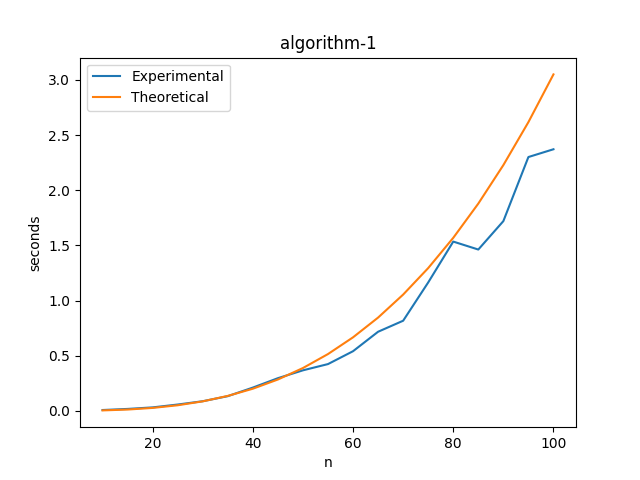
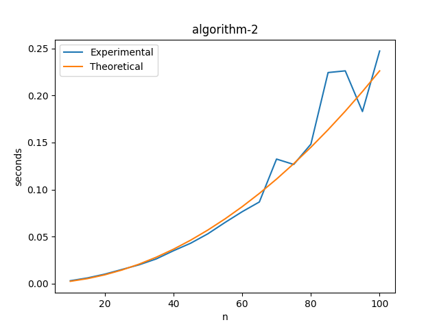
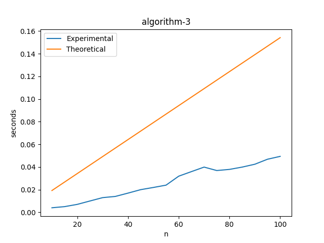
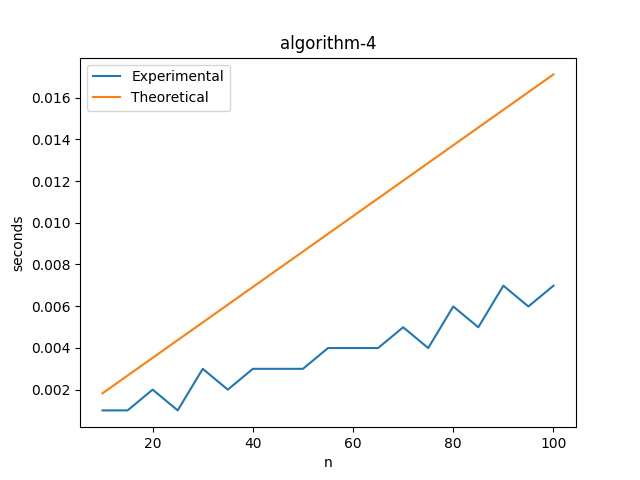

# Perry Bunn
## Getting Started
Code was written using Python 3.9 
### Dependencies 
For the code to run successfully you need to have Python base and MatPlotLib installed in the project directory. To do this you can run `pip install -r requirements.txt`
### Running
To run the program open a console/terminal windows and enter ```python main.py``` while in the project directory.
### Issues running
If you encounter errors when trying to run the program such as 
``` ** On entry to DGEBAL parameter number  3 had an illegal value
 ** On entry to DGEHRD  parameter number  2 had an illegal value
 ** On entry to DORGHR DORGQR parameter number  2 had an illegal value
 ** On entry to DHSEQR parameter number  4 had an illegal value 
``` 
then you need to install `numpy 1.19.3`. This error occurs on windows build 2004, and seems to be an issue with the windows C++ compiler. If you continue to have issues see https://tinyurl.com/y3dm3h86.
This issue can also be avoided by running in WSL.

## Files
. \
+-- README.md \
+-- phw_input.txt \
+-- main.py \
+-- perrybunn_phw_output.txt \
+-- algorithm-1-graph.png \
+-- algorithm-2-graph.png \
+-- algorithm-3-graph.png \
+-- algorithm-4-graph.png \
+-- COMP3270-ProgrammingHW.pdf \
+-- requirements.txt
## Graphs




## Explanation 
After trying to normalize the graphs as best I could the only other reason for discrepancies 
is compiler optimizations for the last two algorithms. As for the some times being faster 
even though they have greater input sizes would come down to computer background processes.
## Certification
I certify that I wrote the code I am submitting. I did not copy whole or parts of it from
another student or have another person write the code for me. Any code I am reusing in my
program is clearly marked as such with its source clearly identified in comments.
